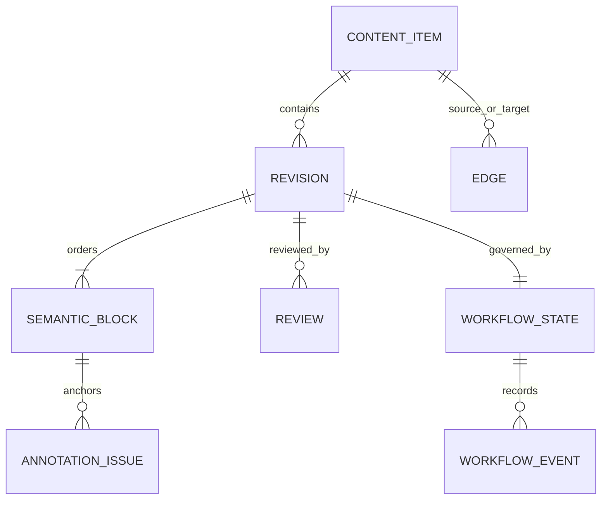

# MathForge 0.2 内容模型

> 本文描述 `src/lib/content-model.ts`、`src/lib/content-workflow.ts`、`src/lib/editorial-store.ts` 与 Euclid 静态 payload 的当前约束。领域对象的 `Object.freeze` 和追加式历史是应用语义，不是防篡改存储。

## 1. 核心对象关系



`ContentItem` 是稳定内容身份；`Revision` 是一次不可覆盖的内容快照；`SemanticBlock` 是命题陈述、构造、证明步骤等可被引用和评论的稳定语义单位。

## 2. ContentItem

`ContentItem` 当前字段包括：

- 永久 `id`、`kind`、`title`；
- `createdAt`、`createdBy`；
- `visibility`；
- 按历史顺序保存的 `revisionIds`；
- 当前编辑版本 `currentRevisionId`；
- 当前公开版本 `publishedRevisionId`；
- `visualizationTrust`。

支持的 kind 为 definition、axiom、postulate、theorem、proposition、problem、proof、principle、paper、counterexample。

`currentRevisionId` 与 `publishedRevisionId` 不应混同：当前编辑版本可以仍是草稿，公开阅读只能使用显式发布指针。

## 3. Revision：追加而不是覆盖

每个 Revision 包含：

- 永久 `id` 与所属 `contentId`；
- 从 1 开始、连续增长的 `version`；
- v2 以后必须存在的 `previousRevisionId`；
- `createdAt`、`createdBy` 与 `origin`；
- 非空 `changeSummary`；
- 完整语义块快照。

新 Revision 在内容对象中始终以 `status: draft` 创建，后续发布状态保存在独立的 `RevisionWorkflowState` 事件链中。这避免把可变工作流状态伪装成原始 Revision 数据。

Euclid 初始 Revision 只能是：

- 机器来源：`origin: machine`、`euclidStatus: raw_machine`；
- 人工保存：`origin: human`、`euclidStatus: editor_draft`。

`math_reviewed` 与 `published` 只能由后续显式工作流事件产生，不能在创建 Revision 时直接写入。

每条本地 Euclid 编辑历史还保存 `sourceBinding = revisionId + contentHash`，明确它基于哪一版静态底本。阅读器只有在绑定与当前 payload 完全一致时才叠加本地 published 中文；编辑器遇到旧版、缺失或不匹配绑定时停止初始化，不覆盖原 localStorage，等待人工迁移。

## 4. SemanticBlock：稳定 ID 与独立顺序

语义块包含：

- 永久 `id`，例如 `euclid-1-47.proof.4`；
- `kind`，例如 statement、construction、proof_step、conclusion；
- 非负整数 `order`；
- 正文 `content`；
- 可选语言与块级 Euclid 编辑状态。

永久 ID 与显示顺序分离。重新排序时只更新 `order`，不能按数组位置重新生成 ID。当前验证会拒绝：

- 空 ID；
- 重复 ID 或重复 order；
- 负数或非整数 order；
- 空正文；
- 非法块状态。

内部编辑存储追加人工稿时，还要求新旧版本拥有相同的 block ID 集合和相同 kind。这样排版调整不会让划线评论和引用因“第几段”变化而全部错位。

## 5. 两套状态轴

### 5.1 发布生命周期

```text
draft
  └─ pending_review
       ├─ revision_requested ─ pending_review
       ├─ approved ─ published
       ├─ rejected
       └─ archived
```

`approved` 还可以回到 `revision_requested` 或进入 `archived`；`published`、`rejected` 也可以归档。不存在任意跳级。

### 5.2 Euclid 内容状态

```text
raw_machine → editor_draft → math_reviewed → published
```

两套状态必须同时满足发布门槛。尤其：

- `raw_machine` 只表示机器辅助导入；
- `editor_draft` 只表示有人保存了编辑稿；
- `math_reviewed` 必须由人工审核角色显式确认；
- Euclid 的 publication `published` 会同时把 Euclid 状态从 `math_reviewed` 推到 `published`。

翻译覆盖率、静态检查、构建成功、图形可运行都不能触发状态升级。

## 6. Review：五个维度绑定同一 Revision

Review 永久绑定 `contentId + revisionId`，并记录 reviewer、时间、摘要及五个维度：

1. `mathematicalCorrectness`：数学正确性；
2. `rigor`：严谨性；
3. `completeness`：完整性；
4. `clarity`：清晰度；
5. `sourceVerification`：来源核验。

每个维度可为 `not_reviewed`、`passed`、`needs_changes`、`not_applicable`。当前 `isReviewComplete` 的规则严格要求五项全部为 `passed`；`not_applicable` 不计为完整 Review。

Review 记录保持追加式；同一 Revision 的**最后一份** Review 是当前有效结论。因此后续 `needs_changes` 会撤销更早的完整通过，获批后若又出现 `needs_changes`，发布动作也会被阻止。旧 Revision 的 Review 不能批准新 Revision，历史 Revision 也不能再新增 Review 或推进状态。新增或修改正文后必须针对最新版本重新审核。

## 7. Edge：有类型、有方向、有来源

通用 Edge 支持：

- `cites`
- `depends_on`
- `generalizes`
- `equivalent_to`
- `counterexample_to`
- `corrects`
- `alternative_proof_of`

source/target 可定位到 content、revision 或 block。provenance 是判别联合：

- `explicit_source_reference`：必须保存 citation，可附 source URL；
- `editorial_inference`：必须保存 editor ID 与推断理由。

验证会报告空或重复 edge ID、自引用、悬空目标、重复关系和缺失 provenance。当前 Euclid 静态 payload 同时保存 outgoing/incoming edge，以及面向阅读 UI 的 dependencies/dependents 摘要。

来源材料中可疑的引用不应无痕删除或自动修正；当前 payload 使用 `sourceIssues` 保留这类问题，等待人工处理。

## 8. Annotation 与 Issue

正式模型中的 `AnnotationAnchor` 绑定：

```text
contentId + revisionId + blockId + blockVersion
+ start/end + quote + prefix/suffix
```

这既保存精确范围，也允许正文轻微变化后用引文与上下文重锚。新 `AnnotationIssue` 必须从 `open` 开始，可用类型包括 question、my_understanding、possible_error、alternative_proof、counterexample、background、source_issue。

Issue 状态为 `open → confirmed/resolved/duplicate/rejected`；`confirmed` 还可转到后三种终态。状态处理要求人工 editor、math_reviewer 或 admin。

### 当前 UI 接线情况

公开阅读页使用既有 `mf_passage_annotations_v1`：它已经保存 `blockId + version + range + quote + prefix/suffix`，能标注旧版本并尝试重锚，但仍是独立的本地讨论结构。它尚未把每条讨论转换成正式 `AnnotationIssue`，也没有把 Issue 状态工作流暴露为完整管理 UI。不能把“领域类型已定义”写成“社区 Issue 审核系统已上线”。

## 9. Visibility

`VisibilityPolicy` 支持：

- `private`
- `restricted`，要求非空且不重复的 `allowedUserIds`
- `public`

在本地 Euclid 编辑存储中，初始化内容为 private；只有发布当前 Revision 时才设置 `publishedRevisionId` 并改为 public。归档最后一个已发布 Revision 会恢复为 private。

Visibility 目前是客户端数据约束，不是后端访问控制。修改 localStorage 的人可以伪造字段，因此不能用于保护敏感内容。

## 10. VisualizationTrustLevel

| 值 | 模型含义 | 不能据此声称 |
|---|---|---|
| `none` | 无绑定可视化 | 页面一定没有其他装饰图 |
| `concept_illustration` | 相关概念示意 | 图已逐步证明当前命题 |
| `proposition_specific` | 针对当前命题配置 | 数学关系已人工核验 |
| `verified` | 同时具备 review ID、审核人、审核时间、renderer revision、当前内容哈希的人工核验凭据 | 存在服务端签名或机构认证 |

生成器、编辑器和阅读器不得根据 renderer 存在、动画正常或视觉相似度自动升级。当前 renderer ID、适用范围、几何类型与实现 revision 由独立 manifest 声明；运行时 schema 会拒绝没有完整 attestation、未知 renderer、旧 renderer revision 或与当前内容 Revision 哈希不一致的 `verified`，展示组件也要求 attestation 中的 revision 与该 manifest 精确相等，否则安全降级且不显示“已核验”。

## 11. 不变量与失败策略

当前模型和本地仓储共同维护：

- Revision 链版本连续且 previous 指针连续；
- 所有 Revision 属于同一 ContentItem；
- `currentRevisionId` 指向最新版本；
- 发布指针必须指向 workflow 为 published 的 Revision；
- approved/published 必须存在同版完整 Review；
- 审核与状态变化只能作用于当前 Revision，未保存正文不能审核；
- Euclid published 必须有连续的人工状态事件；
- workflow 事件拥有唯一 ID、actor、时间和非空理由；
- 机器数据不能自动获得人工状态，机器 v1 必须先追加人工 editor_draft；
- 本地编辑历史绑定静态语料的 Revision ID 与 SHA-256 内容哈希；绑定缺失或漂移时停止覆盖当前底本；
- `math_reviewed` / approved Revision 的后置否决必须先显式退回并追加新的 `editor_draft`；published Revision 必须先显式归档再追加新稿。`needs_changes` 绑定新 Revision，不能与旧版本保留的审核结论并存；非法组合在写入前拒绝；
- 浏览器写操作通过同源 Web Locks 独占锁包住完整的“读取、校验、写回”事务；不支持 Web Locks 或没有注入协调器时保持只读；
- `expectedPreviousRevisionId` 与锁内原始字节复核继续用于发现陈旧基线和不遵守锁协议的外部改写，但不再称为原子 CAS，也不等于数据库事务。

损坏或不支持的数据不会静默变为 published。安全读取返回空结果和显式错误；普通读取抛出异常，并保留 localStorage 原值。

## 12. 回滚与迁移规则

逻辑上的 Revision 历史是追加式的，但 localStorage 本身不是 WORM 存储，整个 JSON 仍会在每次保存时被重写。当前正确回滚方式是：

1. 读取旧版本；
2. 以旧内容为基础创建新 Revision；
3. 写明恢复原因；
4. 对新 Revision 重新 Review 和发布。

不得删除中间版本、覆盖旧正文或直接移动发布指针来制造“已回滚”的假象。

`mf_editorial_store_v1` 不自动迁移未知 schema。未来升级需要新 key、原始数据备份、显式转换、往返校验以及失败回退。静态 Euclid schema 与本地编辑 schema 是两个不同的 version 1，也应分别演进。
