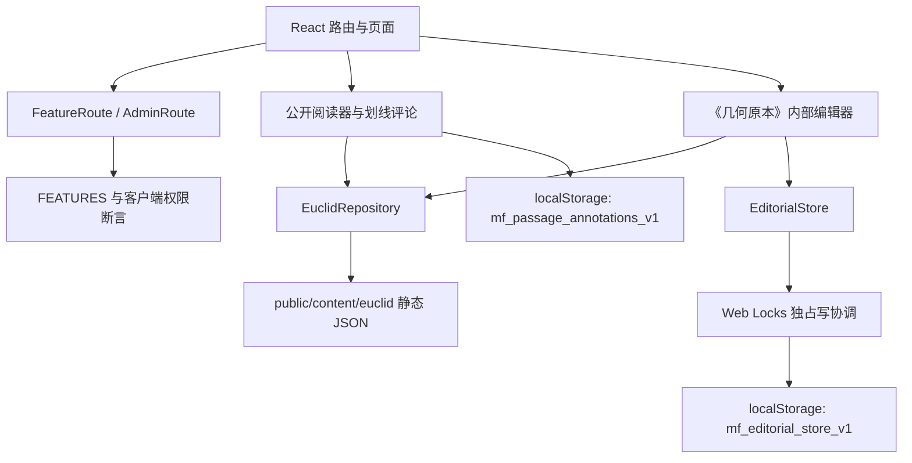

# MathForge 0.2 架构说明

> 文档状态：描述当前仓库中的 0.2 实现，不是未来方案承诺。
> 最重要的边界：MathForge 0.2 仍是纯前端、本地优先的编辑试验版。身份、权限、审核记录与“发布”状态均可被本机浏览器数据的拥有者篡改，不能替代服务端鉴权、数据库审计或正式出版流程。

## 1. 0.2 的目标

0.2 不试图一次完成公开社区和生产级内容管理系统。当前实现先解决四个底层问题：

1. 把数学内容表示为稳定语义块与不可覆盖的 Revision 历史。
2. 把机器原稿、人工编辑稿、数学审核与发布明确分开。
3. 把《几何原本》从首屏整包加载改为目录、卷索引、单条正文三级按需加载。
4. 在公开投稿冻结期间，为本地管理员提供可验证的编辑工作流原型。

## 2. 当前运行结构

各层的职责如下：

| 层 | 当前实现 | 边界 |
|---|---|---|
| 页面与路由 | React Router；页面使用 route-level `lazy` 加载 | 只控制产品入口，不是安全网关 |
| 功能开关 | `src/config/features.ts` 集中定义投稿、附件与内部编辑开关 | 开关随前端代码交付，可被调试工具绕过 |
| 权限断言 | 路由、页面与普通内容存储入口共同检查 feature flag 和 actor | 没有服务端再次验证 |
| Euclid 读取仓储 | `EuclidRepository` 逐级获取静态 JSON，并用 Zod 做运行时结构校验 | 校验结构与引用一致性，不校验数学真伪 |
| 编辑领域模型 | `content-model.ts`、`content-workflow.ts` 提供纯函数与状态守卫 | 角色来自客户端对象，不是可信身份 |
| 编辑持久化 | `EditorialStore` 将源绑定、版本、Review、状态事件保存在 localStorage；浏览器用同源 Web Locks 串行化完整写事务，缺少锁能力时写入 fail closed | 单浏览器、无自动冲突合并、无防篡改存储；Web Locks 不是数据库事务 |
| 划线讨论 | 以语义块、版本、引文与上下文保存本地评论 | 尚未与正式 `AnnotationIssue` 审核工作流完全合并 |

## 3. 路由与加载边界

`src/App.tsx` 对登录、题库、试卷、第一性原理、实验室、工具和内部编辑器使用动态导入。当前关键路由为：

- `/principles`：先加载《几何原本》轻量目录，再按所选卷加载卷索引。
- `/principles/:id`：`PrincipleDetailRoute` 区分 Euclid 条目与原有文章；Euclid 条目只请求当前 entry。
- `/internal/euclid/:id/edit`：仅在开发模式且客户端用户的 `isAdmin` 为真时显示内部编辑器。
- `/problems/new`、`/problems/:id/new-solution`、`/papers/new`、`/principles/new`：由公开投稿开关包裹，0.2 默认关闭。

`AdminRoute` 的提示文字已经明确：内部编辑入口是本地开发原型，不构成服务端权限系统。生产构建中 `adminContentManagement` 为 false。

## 4. 《几何原本》的分层数据架构

静态资源位于 `public/content/euclid/`，使用 schema version 1：

1. `catalog.json`：十三卷元数据、语料来源与全局计数。
2. `books/NN.index.json`：单卷条目列表、摘要、状态和正文路径。
3. `entries/<id>.json`：单条命题、定义、公设或公理的语义块、来源表面、依赖边与可视化声明。

`EuclidRepository` 分别提供 `loadCatalog`、`loadBookIndex` 和 `loadEntry`。无 `AbortSignal` 时会在内存中缓存 Promise；失败的请求会从缓存移除，允许后续重试。所有响应都经过 Zod 校验，包括：

- schema version、卷号和条目 ID；
- 语义块的归属、显式顺序、唯一 ID 与 Revision 对应关系；
- 出入边方向与来源块是否存在；
- 可视化信任级别、`verified` 人工核验凭据及其当前 Revision 哈希绑定；
- source issue 结构。

当前生成语料统一标记为 `raw_machine`。翻译流水线覆盖完整、JSON 校验通过或页面能正常显示，都不表示它经过编辑审核或数学审核。

## 5. 阅读路径与本地正式稿

Euclid 阅读页始终先取得静态 entry。随后它检查本地 `EditorialStore`：

- 如果没有本地正式发布 Revision，继续展示静态 `raw_machine` 内容和来源表面；
- 只有 `ContentItem.publishedRevisionId` 指向经过完整事件链的本地 Revision，并且本地 `sourceBinding` 与当前静态 Revision ID、内容哈希一致时，才在当前浏览器显示“人工发布 Revision”；
- 损坏、不支持或伪造不完整的编辑存储不会被当作已发布内容。

这里的“发布”只表示当前浏览器中的工作流状态成立，不表示内容已经上传服务器、同步给其他用户或获得机构背书。

I.47 的现代解释、替代证明和常见错误属于独立的 `editorial_supplement`。每个补充块有稳定 ID、显式 v1 与 provenance，但当前统一显示为 `raw_machine`、未经人工数学审核，并明确说明其参考链接没有混入 Heath 原文依赖图。

## 6. 编辑路径

内部编辑器采用三栏语义：

- 来源栏：原始来源表面，只读；
- 机器栏：机器中文或来源缺口提示，只读；
- 正式中文栏：人工编辑内容，可保存为新的 `editor_draft` Revision。

首次进入时，静态 entry 会被初始化为私有的机器 Revision v1。保存正式中文时：

- 只能由客户端模型中的 human editor/admin 执行；
- 必须保留全部永久 semantic block ID 与 block kind；
- 必须基于页面实际打开的最新 Revision；有未保存正文时不能 Review 或改变状态；
- 新建 v2、v3……，不覆盖旧版本；
- 记录 `createdBy`、时间、`changeSummary` 与前序 Revision；
- 保存不会自动提交审核、批准或发布。

“疑似误译”和“待数学审核”标记另存于 `mf_euclid_editor_flags_v1:<contentId>`，只是本地编辑提示，不会改变正式审核状态。

## 7. 发布工作流与信任边界

发布生命周期与 Euclid 编辑状态是两条相关但不同的轴：

- 发布生命周期：`draft → pending_review → approved → published`，并允许 `revision_requested`、`rejected`、`archived` 等显式分支。
- Euclid 状态：`raw_machine → editor_draft → math_reviewed → published`。

所有升级都要求显式动作和 human actor。保存 `editor_draft` 会新建 Revision，并记录操作者、时间与 change summary；后续审核和发布状态变化则追加含事件 ID、前后状态、操作者、时间和非空理由的 workflow event。Review 只作用于当前 Revision，最后一份 Review 是当前有效结论；批准与发布时都要求它五项完整通过。Euclid 发布还必须先达到 `math_reviewed`。已达到 `math_reviewed`、approved 或 published 的 Revision 不能再直接追加否决 Review：必须先显式退回或归档，再追加新的 `editor_draft`，把 `needs_changes` 绑定到新版本，避免旧人工结论与新否决同时成立。

机器或后台任务不能把内容升级为 `editor_draft`、`math_reviewed` 或 `published`；机器 v1 也不能原地获得人工状态，必须先追加 human-origin Revision。不过这些守卫只运行在客户端 JavaScript 中，不能抵抗拥有浏览器存储和调试权限的人。

## 8. 可视化信任级别

当前模型使用四级声明：

| 级别 | 含义 |
|---|---|
| `none` | 没有与该条目绑定的可视化 |
| `concept_illustration` | 仅说明相关概念，不能当作该命题的逐步证明 |
| `proposition_specific` | 针对该命题配置，但尚未被标记为完全验证 |
| `verified` | 具备完整人工 attestation，并绑定审核人、审核时间、renderer revision 与当前内容哈希 |

信任级别不会自动随“能渲染”“能拖动”或测试通过而升级。中立的 renderer manifest 记录当前 renderer ID、适用范围、几何类型和实现 revision；运行时 schema 拒绝裸 `verified`、未知 renderer、旧 renderer revision 或内容哈希不一致的 attestation，展示层也执行同一 revision 匹配并把不可信输入降级。当前实现仍没有服务端签名来证明审核身份。

## 9. 公开投稿冻结

0.2 的默认开关为：

- `publicContribution: false`
- `attachmentUpload: false`
- `adminContentManagement: import.meta.env.DEV`

投稿按钮被隐藏，投稿路由被 `FeatureRoute` 拦截，`store.addProblem`、`addSolution`、`addArticle`、`addPaper` 也会再次执行客户端权限断言。附件仅预留 PNG、JPEG、WebP、PDF 白名单，但由于附件开关关闭，当前不接受上传。

普通评论与本地划线讨论不是正式内容发布流程的一部分，冻结公开投稿不等于关闭所有本地互动。

## 10. 故障、回滚与迁移

### 10.1 损坏数据

`EditorialStore` 对 JSON、schema、Revision 链、workflow 事件链、Review、visibility 和 published 指针进行恢复校验。`inspect()` 在失败时返回安全空集合与显式错误；普通读取则抛出错误。实现不会静默重置原值，也不会把损坏数据降级为已发布内容。

浏览器修改通过同源 Web Locks 独占锁覆盖完整的读取、校验与写回事务；缺少锁能力时写入口保持关闭。锁内仍复核原始字节以发现不遵守协议的外部改写，但这项复核不是原子 CAS，也不能替代数据库事务、跨设备并发控制或冲突合并。

### 10.2 回滚

当前模型禁止覆盖旧 Revision。若要恢复旧内容，正确做法是读取目标历史版本，以其内容为基础追加一个新的 Revision，并记录恢复理由。当前 UI 尚没有完整的“一键恢复为新版本”流程；不能通过改写 `currentRevisionId` 或删除后续历史来模拟回滚。

若已发布 Revision 被显式归档，存储会回退到更早的已发布 Revision；如果不存在，则清除 `publishedRevisionId` 并把 visibility 改回 private。

### 10.3 schema 迁移风险

编辑 key 为 `mf_editorial_store_v1`，版本号同时存在于 key 和 payload。当前没有自动迁移未知 schema：遇到不支持的版本会保留原始字节并报错。升级前必须导出备份，编写显式迁移与往返测试，核验 Revision 链、永久 block ID、Review 和事件顺序，再切换新 key。

静态 Euclid 资源也使用 schema version 1。生成器与读取器必须同版本部署；否则运行时校验会拒绝 payload。

## 11. 当前不具备的能力

0.2 不应被描述为已经具备以下能力：

- 服务端登录、会话、角色和访问控制；
- 数据库事务、跨设备同步与多编辑者并发锁；
- 防篡改审计日志、审核人签名与可追溯发布包；
- 生产环境内容后台或普通用户投稿；
- 自动判定数学正确性；
- 对全部 Euclid 翻译、依赖和可视化的人工审校。

这些缺口不否定本地工作流的价值，但决定了 0.2 的可信结论只能是“模型和守卫已实现并可测试”，不能是“生产安全或内容已审核”。
